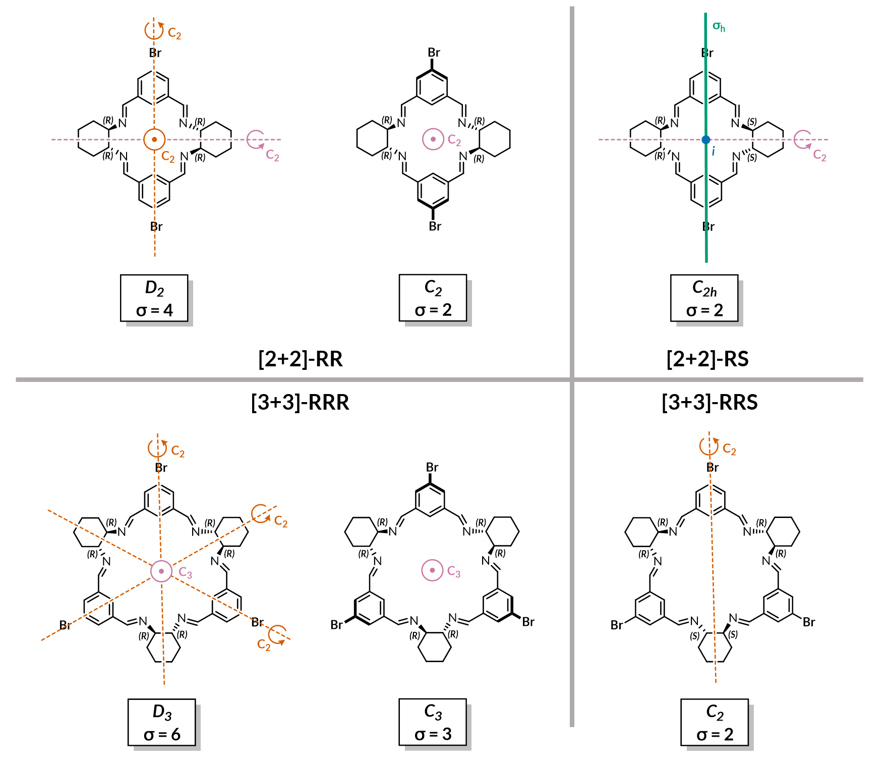

# Modelling files for Scholes *et al.*

The main objective is to calculate relative formation energies of
a family of bromo-substituted isotrianglimines to understand their
dynamic behaviour observed in solution.

## Packages used

* python >= 3.9.
* [rdkit][1] >= 2021.09.5, used 2022.03.2.
* xtb ([here][2] and [here][3]) 6.4.1 (23d549d) and CREST([here][4] and [here][5]).
* [orca][6] 5.0.1 and Orca 5.0.3.
* [spyrmsd][7], works best with `graph-tool`.

[1]: https://doi.org/10.5281/zenodo.6483170
[2]: https://doi.org/10.1021/acs.jctc.8b01176
[3]: https://doi.org/10.1002/wcms.1493
[4]: https://doi.org/10.1039/C9CP06869D
[5]: https://doi.org/10.1021/acs.jctc.9b00143
[6]: https://doi.org/10.1002/wcms.1606
[7]: https://doi.org/10.1186/s13321-020-00455-2

## Embedding molecules: `embed_molecules.py`

The workflow starts with embedding InChI's of the molecules using the
[ETKDGv3][8] algorithm as implemented in `rdkit`. The structures are minimised
with the MMFF force field and only all-*E* conformers are kept. If none
all-*E* structures are found, then further 1000 conformations are generated
with a different random seed. Lowest energy conformation thus identified is
used for further calculations. Requires RDkit minimum 2021.09.5 to reproduce
the isomer detection workflow. Constraints migt be fixed in a future release.

[8]: https://doi.org/10.1021/acs.jcim.0c00025

## Conformer search: `conformer_search.py`

With the embedded structures at hand, CREST is used with an GFN2-xTB to perform
conformational search. Redundant conformers are then removed with an RMSD
thershold of 0.5Å using sPyRMSD. Symmetry-corrected RMSD calculations are
necessary for the symmetric [2+2] and [3+3] macrocycles.

Each conformer is optimised (using Orca) with the [B97-3c][9] functional and
confirmed to be a minimum with a frequency calculation. The calculations used [atom-pairwise dispersion correction][10] with the Becke-Johnson damping scheme ([D3BJ][11]) and the universal solvent model based on density ([SMD][12]) for implicit treatment of chloroform. Entropy contributions were computed according to the [QRRHO][13].

[9]: https://doi.org/10.1063/1.5012601
[10]: https://doi.org/10.1002/jcc.21759
[11]: https://aip.scitation.org/doi/10.1063/1.3382344
[12]: https://doi.org/10.1021/jp810292n
[13]: https://doi.org/10.1002/chem.201200497

## Single point calculations: `sp_energy.py`

Final energetics were obtained with single point energies at a DFT level of theory. For all reported calculations, the [def2-QZVP][14] basis set with the [def2/J][15] auxilary basis set were used. Results were compared between the [M06-2X][16], [PBE0][17], [PW6B95][18], [ωB97X-V][19] (as well as the D3BJ-corrected variant ωB97X-D3), and [ωB97M-V][20]. The functionals were corrected for dispersion either following Grimme's D3 scheme or using the non-local [VV10 correction][21]. Final energies were calculated both in vacuum and with SMD chloroform solvation.

[14]: https://doi.org/10.1039/B508541A
[15]: https://doi.org/10.1039/B515623H
[16]: https://doi.org/10.1007/s00214-007-0310-x
[17]: https://doi.org/10.1063/1.478522
[18]: https://doi.org/10.1021/jp050536c
[19]: https://doi.org/10.1039/C3CP54374A
[20]: https://doi.org/10.1063/1.495264
[21]: https://doi.org/10.1063/1.3521275

## Formation energy calculations: `formation_energy.py`

Formation energies were obtained following standard thermodynamic relationships.
Electronic formation energy is simply the difference in final single point energies
calculated at the DFT level of theory. As thermal corrections depend predominantly on
geometry, they were extracted from the relatively cheap frequency calculation
using the B97-3c method. All thermochemical properties were calculated at 298.15K.

Enthalpy is calculated as U + kB*T, where U is the inner energy, i.e. the sum of
the total electronic single point energy, the zero point energy and the thermal
energy due to vibrations, rotations, and translations:

(1) U = E(el) + E(ZPE) + E(vib) + E(rot) + E(trans)

(2) H = U + kB*T

Entropy contributions are the sum of electronic, vibrational, rotational and
translational entropy:

(3) T\*S = T\*(S(el)+S(vib)+S(rot)+S(trans))

Rotational entropy was calculated assuming different symmetry numbers, sn.
The symmetry numbers for aldehyde (C2v), amine (C2) and water (C2v) are all 2.
Depending on the degree if idealisation of the macrocycle structures,
the symmetry numbers for the trianglimines can be taken as:

* For [2+2]-RR: 1 (no symmetry), 2 (C2 bowl) or 4 (D2 planar aromatic rings).
* For [2+2]-RS: 1 (no symmetry) or 2 (C2h).
* For [3+3]-RRR: 1 (no symmetry), 3 (C3 bowl) or 6 (D3 planar aromatic rings).
* For [3+3]-RRS: 1 (no symmetry) or 2 (C2).

Resulting differences to the Gibbs free energies of formation are within 5 kJ/mol,
which is probably within the error of the method.

