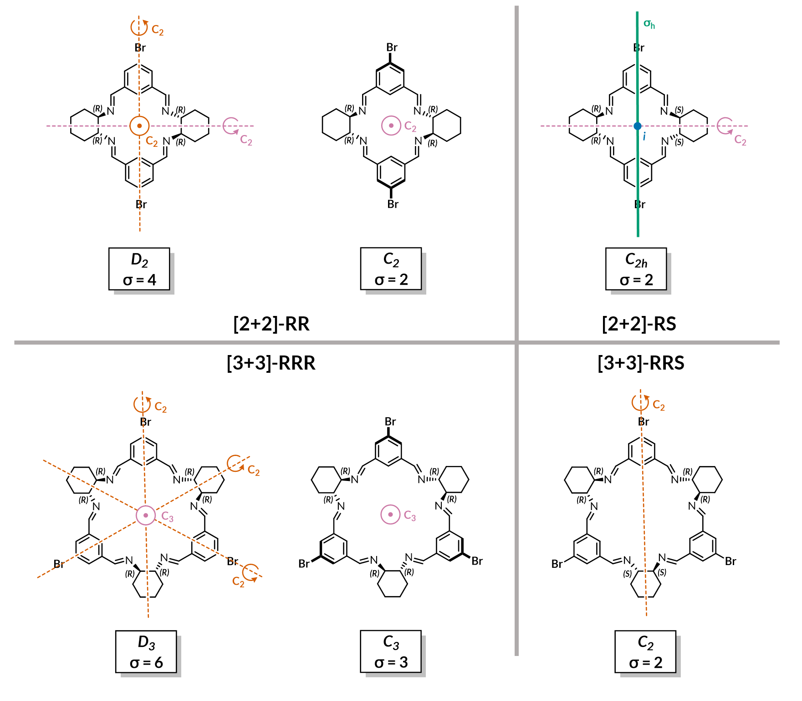

## Simple symmetry corrections

Can also just look at the Gibbs free energy contribution to the formation energy originating from external rotational entropy.
However, given how crude this model is, those corrections are inconsequential.

### For the [2+2] system

K_sigma([2+2]) = (2^2 * 2^2)/(2^4 * sn) = 1/sn

where `sn` is the symmetry number for the [2+2] macrocycle.

dG([2+2]) = -RT ln(1/sn)

which is:

dG = 0 for sn = 1
dG = +1.7 kJ/mol for sn = 2 (0.4 per imine)
dG = +3.4 kJ/mol for sn = 4 (0.9 per imine)

### For the [3+3] system

K_sigma([2+2]) = (2^3 * 2^3)/(2^6 * sn) = 1/sn

where `sn` is the symmetry number for the [2+2] macrocycle.

dG([2+2]) = -RT ln(1/sn)

which is:

dG = 0 for sn = 1
dG = +2.7 kJ/mol for sn = 3 (0.5 per imine)
dG = +4.4 kJ/mol for sn = 6 (0.7 per imine)

### Entropy from rotations and translations

There is also a simple cheminformatics model by Murray and Verdonk (J. Comp. Aid. Mol. Des., 16, 741, 2002). They estimate that change in entropy due to restricted rotations and translations upon drug binding to protein is:

57 + 5\*R\*ln(m) J/(mol K)

which for the different species involved in our equilibria are:

* [2+2] is dG(rot+trans) = -95.9 kJ/mol
* [3+3] is dG(rot+trans) = -100.9 kJ/mol
* Amine is dG(rot+trans) = -75.7 kJ/mol
* Aldehyde is dG(rot+trans) = -83.4 kJ/mol
* Water is dG(rot+trans) = -52.8 kJ/mol

Therefore, the corresponding rotational and translational entropy contributions to the formation energy, as above, are:

* [2+2] dG = 11.1 kJ/mol (2.8 kJ/mol per imine)
* [3+3] dG = 59.6 kJ/mol (9.9 kJ/mol per imine)

The difference between those is around 7 kJ/mol pre imine bond.
The electornic energy differences per imine bond for [2+2] and [3+3] formation are around 5 kJ/mol. The results are therefore within error, as all those entropy estimations are extremely crude. However, the trend is clear and it can be understood that [4+4] is not formed in solution on entropic ground. There is a very fine balance between the formation of [2+2] and [3+3], which supports the extremely dynamic behaviour of the system.